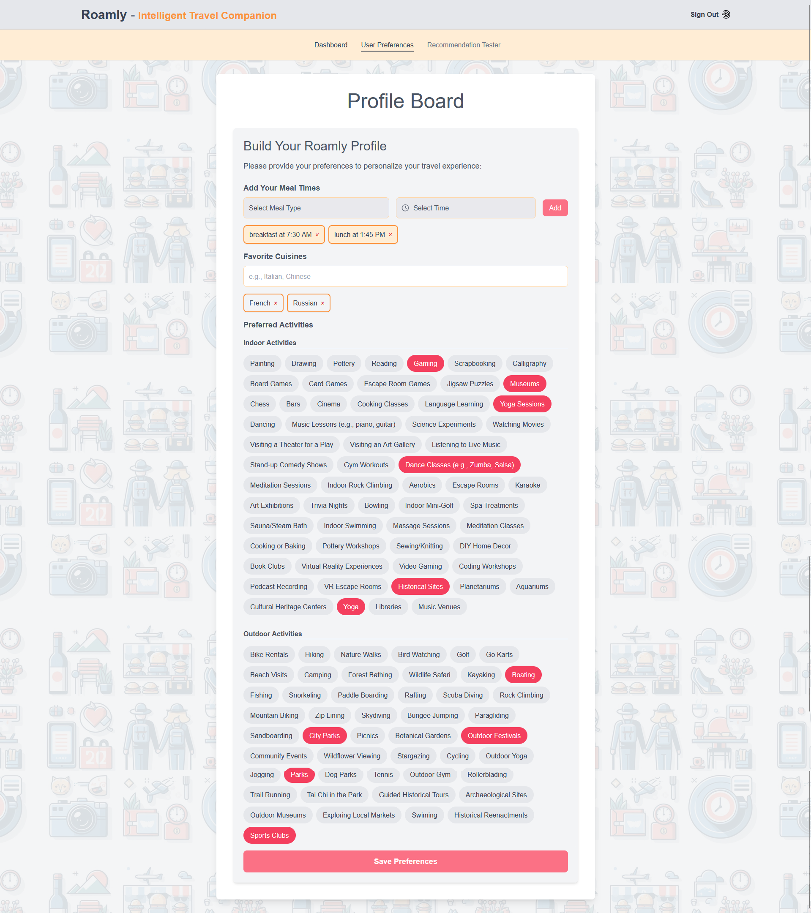
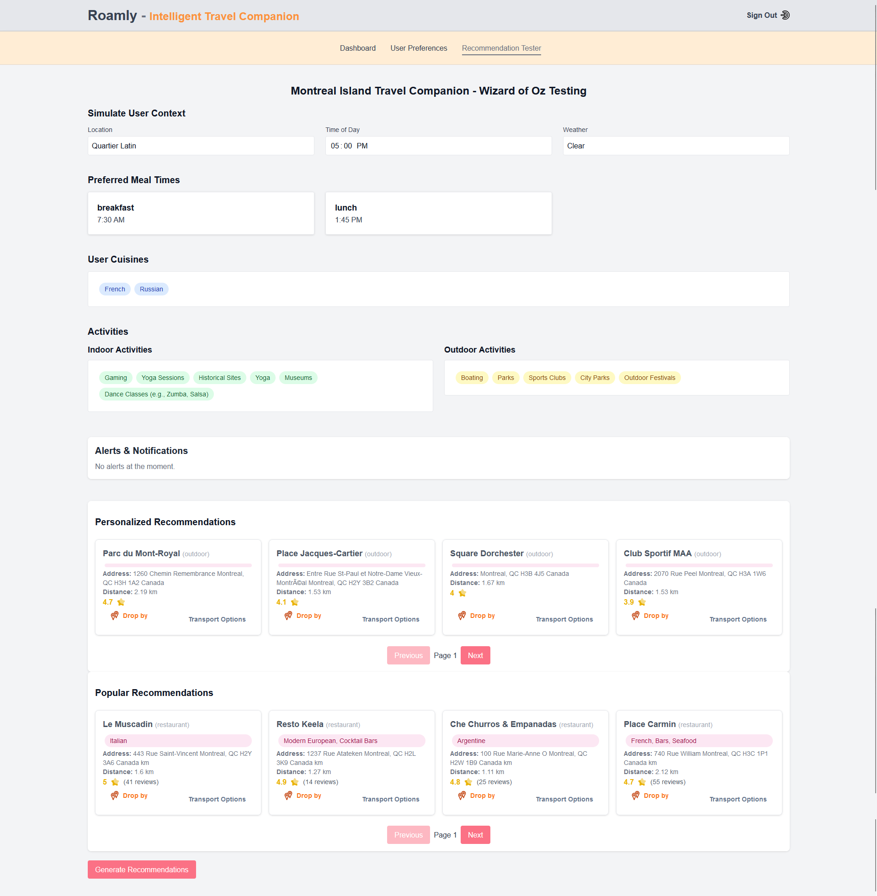

Vue 3 + Vite

This template should help get you started developing with Vue 3 in Vite. The template uses Vue 3 `<script setup>` SFCs, check out the [script setup docs](https://v3.vuejs.org/api/sfc-script-setup.html#sfc-script-setup) to learn more.

Learn more about IDE Support for Vue in the [Vue Docs Scaling up Guide](https://vuejs.org/guide/scaling-up/tooling.html#ide-support).

